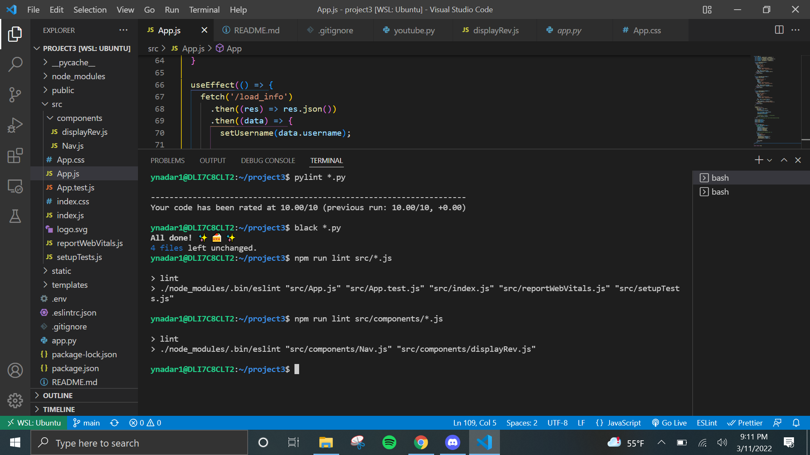

# Movie Discovery App Milestone 3

This is a movie discovery web application
that shows information about your favorite movies including
links to their wikipedia page. This data is dynamically fetched
using the TheMovieDataBase, Wikipedia, and YouTube APIs.

The app also lets the user create an account and login where they can
save a list of favorite movies by looking up the movie title or actor name.
User will be able to leave reviews and ratings for movies on the main page
and will be able to see previous comments by other users.

Newest addition is the ability to make changes to user's comments on the client side and then finally send the changes to the server using React.


### App Displays:

- Movie Title
- Movie Tagline
- Movie Genres
- Movie Poster
- Wikipedia Link
- YouTube Link to Movie Trailer\*
- User's Fav Movie List\*
- Comments and Reviews
- Search by Movie Title\*
- Search by Actor Name\*
- My Reviews Page

### Tech Stack:

- Python
  - flask for web framework
  - requests for api calls
  - SQLAlchemy for postgres db
- HTML & CSS
- Java Script
  - React for reactive components (My Reviews Page)

## Installation

1. Clone project from git hub

```bash
  git clone https://github.com/csc4350-sp22/milestone3-ynadar1.git
```

2. Install the following packages:

```bash
  pip install requests
  pip install python-dotenv
  pip install flask
  pip install flask-login
  pip install Flask-SQLAlchemy==2.1
  pip install psycopg2-binary
  pip install flask-marshmallow
  pip install marshmallow-sqlalchemy
  npm install
  pip install Flask-Session
  sudo apt install postgresql
```

3. Create a .env file to store the following as environment variables:
   <br>TMDB_KEY from https://developers.themoviedb.org/3/getting-started/introduction <br>
   YOUTUBE_KEY from https://developers.google.com/youtube/v3/getting-started

```bash
  TMDB_KEY=""
  DATABASE_URL=""
  SECRET_KEY=""
  YOUTUBE_KEY=""
```
4. Run the command below in the main directory to pull in all the node packages you need.

```bash
  npm ci
```

5. To run the code, first run. Remember to run this command after any change in a React file.

```bash
  npm run build
```

6. Then run app.py.

```bash
  python3 app.py
```


## Questions

1.  <b>What are at least 3 technical issues you encountered with your project milestone? How did you fix them? </b>

- The first major error I encountered was a ```TypeError: Object of type Review is not JSON serializable```. I got this when I was trying to pass my database entries from the backend to the frontend to display using React. To fix it, I followed this [YouTube video](https://youtu.be/kRNXKzfYrPU) that used Flask-Marshmallow to return JSON versions of the Flask-SQLAlchemy models.

- Another issue I was having was initializing my reviews state variable so that it holds all the review information to display on the React side. React was able to read the "data.reviews" array and show it on the console. But when I was using setState to pass this array to a state variable it is was not updating. I eventually I found this [article](https://dev.to/raphaelchaula/how-to-update-object-or-array-state-in-react-4cma) that suggested creating a copy array, pushing the new values to that, and then using setState.

- After I collected and stored the update information in React, I was having trouble sending that information back to the backend to be commited to the database. I used this helpful [YouTube](https://youtu.be/8SkiIAbFbNs) tutorial that used Webhook.site as a test API to visually see your data being posted. Once I knew my data was safelly being sent from React, I use the resources under <b>Project Tools: Fetch</b> in the project specs to figure out how to retrive the data from Flask.

- Lastly, I set `contentEditable = true` for my rating and comment text areas so that users can directly modify the values in those fields. I was tracking these changes using `onInput` who's events occur  immediately after the value of an element has changed. As I was testing, I noticed that it was picking every minute change which was not ideal. After researching, I learned that `onBlur` would be the more appropriate option as its events occur when the element loses focus, after the content has been changed. ([Source](https://stackoverflow.com/questions/38256332/in-react-whats-the-difference-between-onchange-and-oninput))

2. <b>What was the hardest part of the project for you, across all milestones? What is the most useful thing you learned, across all milestones? </b>

- The hardest part for me was understanding and figuring out how React/Js. Since this was my first time programming in this language, it took me longer to implement things and look up the correct syntax. I had a rough time setting up the children and parent components and keeping track of all its state variables since I didn't plan out how I will structure my program which I wish I did before I began the project. The most useful thing I learned while working on this project is the complexity of a web application and how they manage all these these frameworks, softwares, libraries, and API so seamlessly. As a user, I never thought about the intricacy of applications like these until now.

### Extra Credit
Created a shortcut in package.json to skip running `npm run build` after every change by adding a watch command that will look for all changes in the src folder and files with extensions js and auto-create a build each time you save/make a change. 

I also gave the user the option to edit the comments themselves apart from the rating.


### Linting Note\*

For certain pylint errors (especially the errors for the database models), I handled them in my settings.json file inside my .vscode folder. So they don't show up on my end but may show up on your end when you run `pylint *.py`.

Here is the screenshot of my linting results:



## Author

- [@YaliniNadar](https://github.com/YaliniNadar)
